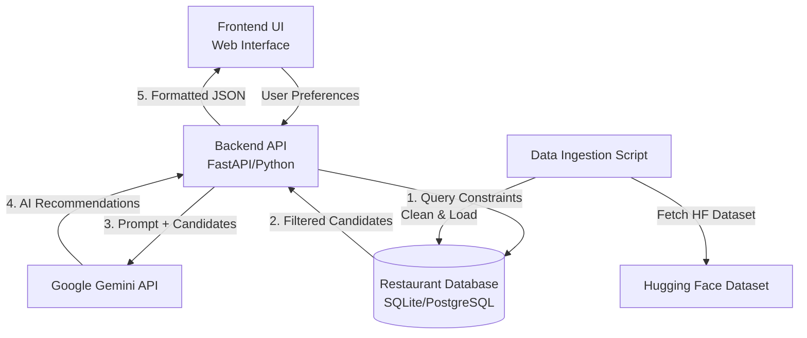

# Zomato AI Restaurant Recommendation Service - Architecture

## System Overview
The system takes user preferences (price, location, minimum rating, and cuisine), retrieves relevant restaurant data from the specified Zomato dataset, and uses Google's Gemini LLM to generate clear, personalized recommendations with natural language rationales.

## High-Level Architecture Diagram

## Project Phases

### Phase 1: Data Pipeline & Ingestion
* **Goal**: Prepare the restaurant data from Hugging Face for efficient retrieval.
* **Component**: Python Data Script (`pandas`, `datasets`, `sqlite3` or SQLAlchemy)
* **Tasks**:
  1. Download the dataset `ManikaSaini/zomato-restaurant-recommendation` via Hugging Face API.
  2. Data cleaning: normalize text, handle missing values, and structure pricing/ratings.
  3. Load the structured data into an SQL database. This allows us to quickly filter restaurants by place, rating, price, and cuisine before sending candidates to the LLM (acting as a pre-filter algorithm to prevent LLM hallucination and manage context window limits).

### Phase 2: Backend API Service
* **Goal**: Connect the UI to the candidate database and the Gemini API.
* **Tech Stack**: Python with FastAPI (fast, built-in validation via Pydantic).
* **Tasks**:
  1. Build a `/api/recommend` endpoint that receives the user's criteria.
  2. **Retrieval**: Query the database to fetch the top 10-20 restaurants that match the hard constraints (place, price, rating, cuisine).
  3. **AI Generation**: Construct an intelligent prompt for Gemini containing the user's exact preferences and the retrieved candidate restaurants.
  4. Parse Gemini's output into a structured JSON response containing the recommended restaurants and a personalized, AI-written justification for why they fit the user's needs.

### Phase 3: Frontend User Interface (UI)
* **Goal**: Provide an interactive, premium, and aesthetic interface for users to enter preferences.
* **Tech Stack**: HTML/CSS/Vanilla JS (or React/Vite for a more robust Single Page App), using modern UI elements (e.g., dynamic color palettes, sleek typography, micro-animations, and glassmorphism).
* **Tasks**:
  1. Build a dynamic form with sliders for ratings, dropdowns for cuisine/location, and price indicators ($, $$, $$$).
  2. Implement an aesthetically pleasing loading state (e.g., a dynamic "Chef AI is analyzing..." animation) while waiting for the Gemini API to respond.
  3. Build a Results Board using a modern Card layout to display the restaurant names, core details, and the custom Gemini recommendation rationale.

### Phase 4: Integration, Testing & Deployment
* **Goal**: Ensure the system works end-to-end flawlessly and is accessible online.
* **Tasks**:
  1. Setup environment variables securely (e.g., `GEMINI_API_KEY`).
  2. Handle edge cases (e.g., graceful fallback messages when no restaurants match the strict database filter).
  3. **Local Testing**: Run the stack locally via `npm run dev` and `uvicorn`.
  4. **Deployment (Optional)**: Dockerize the application and deploy (e.g., Vercel for Frontend, Render/Railway for the API).
